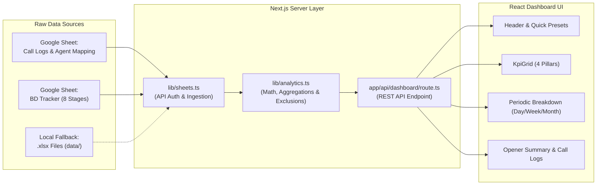

# BD Call & Pipeline Performance Dashboard

A real-time business development performance tracking application connecting **Ultatel Call Logs** and **Google Sheets BD Tracker** spreadsheets.

---

## 1. Core Purpose

The primary objective of this dashboard is to answer four essential business questions for every active sales/BD agent:

1. **How many calls were made?** (Outbound vs. Inbound, Answered vs. No Answer)
2. **How many meetings were booked?** (Across all pipeline stages)
3. **What is the Show (Connection) Rate?**
   - **Call Connection Rate**: $\% \text{ of calls answered}$
   - **Meeting Show Rate**: $\% \text{ of booked meetings attended (excluding No-Shows)}$
4. **What is the Closing Rate?** ($\% \text{ of booked meetings successfully onboarded}$)

All four metrics are computed and viewable across **Daily**, **Weekly**, and **Monthly** time intervals.

---

## 2. System Architecture & Data Flow



---

## 3. Data Ingestion & Transformation

### A. Call Logs Sheet (`1aI0879YxZdu17GHm-QLhOoE8CuFlkpyROvCtRjjuRbw`)
- **Call Logs**: Raw phone log data containing Call Date, Call ID, Extension, Duration, Type (`OUT-Bound` / `IN-Bound`), Outcome (`ANSWERED` / `NO ANSWER`).
- **Agent Mapping**: Maps phone extension names (e.g. `"112 (MMS-Ben Arthur)"`) to normalized Opener names (e.g. `"Ben"`).

### B. BD Tracker Sheet (`1uicpBruuFeno2ES4hNw-TIAwNkGEI37gw8Z-A4yMpC8`)
Reads 8 pipeline stages via single `batchGet` call:
1. `New Meetings`
2. `Follow Ups`
3. `Contract Sent`
4. `Invoice Sent`
5. `Onboarded` (Closed Won)
6. `No-Show`
7. `Dead Leads`
8. `Temporary Inactive`

### C. Agent Exclusion Rules
`Russ`, `George`, and `Caroline` (including `Caroline Richards`) are permanently filtered out during data extraction and metric aggregation.

---

## 4. Key Directory Structure

```
├── apps-script/                 # Google Apps Script code for in-sheet automation
├── data/                        # Local fallback .xlsx files for offline/cached development
├── src/
│   ├── app/
│   │   ├── api/dashboard/       # Next.js API route serving dashboard data
│   │   └── page.tsx             # Main dashboard page layout and tab routing
│   ├── components/
│   │   ├── Header.tsx           # Logo, live status, agent select, and preset filters
│   │   ├── KpiGrid.tsx          # Top KPI cards for Calls, Connection, Meetings, Show, Close
│   │   ├── PeriodicBreakdownTable.tsx # Daily / Weekly / Monthly expandable tables
│   │   ├── OpenerTable.tsx      # Full agent summary table with stage counts & CSV export
│   │   ├── CallLogsView.tsx     # Drill-down raw call logs table with search
│   │   └── DashboardCharts.tsx  # Chart components
│   ├── lib/
│   │   ├── analytics.ts         # Metric computation, date parsing & periodic grouping
│   │   ├── config.ts            # Spreadsheet IDs, tabs list, excluded agents
│   │   └── sheets.ts            # Google Sheets API client, batch fetch & local cache
│   └── types/
│       └── dashboard.ts         # TypeScript data contracts & interfaces
├── MANUAL_AUDIT.md              # Step-by-step manual audit guide
├── PROJECT_OVERVIEW.md          # Project architecture and technical specification
└── WORKLOG.md                   # Engineering changelog & implementation log
```

---

## 5. Running the Application

```powershell
# Development server
npm run dev

# Build for production
npm run build
npm start
```
Default URL: `http://localhost:3000`
