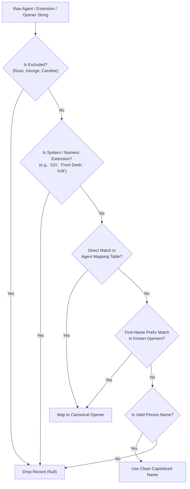

# Agent & Opener Resolution Methodology

This document explains the unified agent mapping and resolution architecture used across the **BD Tracker & Call Dashboard**.

---

## 1. Problem Statement

Raw business development data comes from two independent systems with different naming conventions:

1. **Ultatel Phone System (Call Logs)**:
   - Contains PBX extension strings like `"112 (MMS-Ben Arthur)"` or `"108 (MMS-Kaity James)"`.
   - Often includes non-agent channels (e.g. `"Front Desk"`, `"Conference Room"`, unassigned extensions).
2. **BD Meetings Tracker (Google Sheets / Excel)**:
   - Contains Opener names entered by reps (e.g. `"Ben"`, `"Jane"`, `"Jasmine"`, `"Selene"`).
   - Can have casing differences, partial first names, or full names.

Without a canonical resolver, the system would treat `"Ben"`, `"Ben Arthur"`, and `"112"` as three separate people.

---

## 2. Canonical Resolution Rules

Every raw entity passes through the **Canonical Opener Resolver** ([`src/lib/analytics.ts`](file:///c:/Users/ben.arthur/Desktop/bd%20tracker/src/lib/analytics.ts)):

### Resolution Steps:

1. **Excluded Agent Check**:
   - Matches against `['russ', 'george', 'caroline', 'caroline richards']` case-insensitively (including prefixes/suffixes).
   - If matched, the record is immediately dropped.

2. **System & Non-Agent Filtering**:
   - Automatically drops pure numeric extensions (e.g. `"101"`, `"204"`).
   - Automatically drops channel keywords: `"Front Desk"`, `"Conference"`, `"Support"`, `"IVR"`, `"Unmapped"`, `"Main Line"`, `"Fax"`.

3. **Direct Table Matching**:
   - Checks the `Agent Mapping` sheet (`Call Log Agent Name` $\leftrightarrow$ `Opener Name`).
   - Example: `"Kaity James"` $\to$ `"Jane"`, `"Ben Arthur"` $\to$ `"Ben"`.

4. **First-Name & Prefix Fallback**:
   - Matches `"Ben Arthur"` or `"Ben A."` to `"Ben"`.
   - Matches `"Selene Myles"` to `"Selene"`.

5. **Deduplication & Consolidation**:
   - All call logs and meetings mapped to the same canonical Opener are aggregated together into a single, unified row.

---

## 3. Active Agent Mapping Table

| PBX Call Log Agent Name | Canonical Opener Name |
| :--- | :--- |
| **Kaity James** | **Jane** |
| **Ben Arthur** | **Ben** |
| **Jasmine Green** | **Jasmine** |
| **Selene Myles** | **Selene** |
| **Jimmy Pearson** | **Jimmy** |
| **Nora Atkins** | **Nora** |

---

## 4. How to Add or Change an Agent

1. **In Google Sheets**:
   - Open the **Agent Mapping** tab in your Call Dashboard sheet.
   - Add a new row with column A (PBX name) and column B (Opener name).
2. **In Code (Offline / Fallback)**:
   - Update `agentMappings` array in [`src/lib/sheets.ts`](file:///c:/Users/ben.arthur/Desktop/bd%20tracker/src/lib/sheets.ts).
